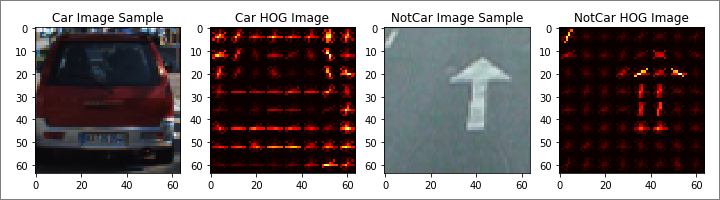
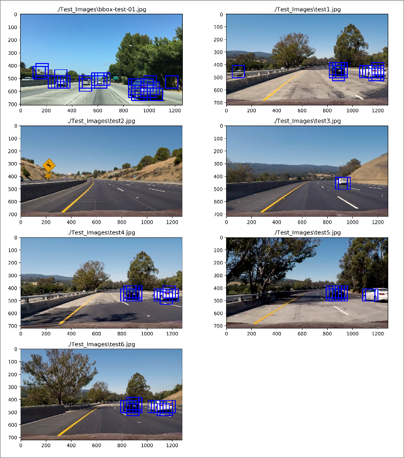
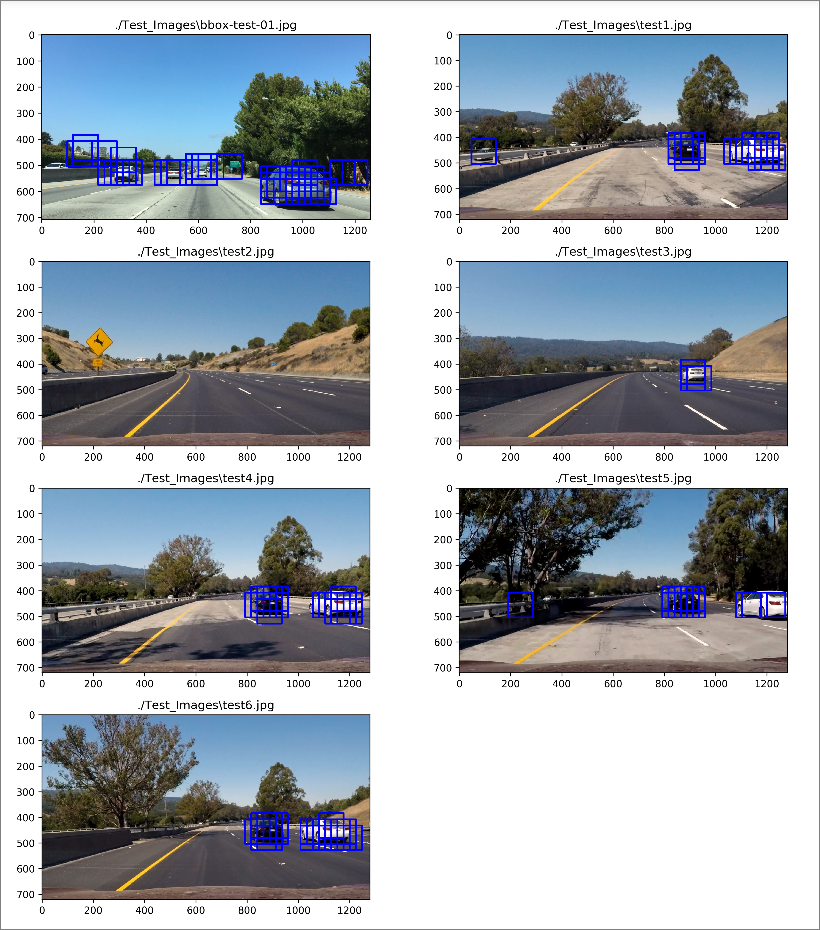

# UDACITY -- Self-Driving Car Engineer [NanoDegree] --
# Part-1--Project-05 - **Vehicle Detection And Tracking**


# PROJECT WRITE-UP

---

## GOALS OF THE PROJECT
The Goals/Steps of this Project are the following:
1. **FEATURE ENGINEERING**: Do Feature Extraction On a Labeled Training Set of Images, Using a Combination of the following Methods, and Create a Feature Vector:
   1. Color Space Transforms.
   2. Histogram of Oriented Gradients (HOG).
   3. Spatial Binning of Color Features.
   4. Histograms of Colors.
2. **CLASSIFIER MODEL TRAINING**: Choose & Train a CLASSIFIER MODEL Using the Feature Vector From Step-1:
   1. Example Choice of CLASSIFIER: Linear SVM (Support Vector Machine).
   2. NOTE: Features Need To Be Normalized, and Randomized & Split Selection Sets To Be Used For MODEL Training & Testing.
3. **VEHICLE DETECTION [PREDICTION By MODEL]**: Implement a **SLIDING-WINDOW** Technique and Use the Trained CLASSIFIER MODEL To Search for VEHICLES in Images.
4. **APPLICATION ON VIDEO STREAM**: Run the VEHICLE DETECTION PIPELINE On a Video Stream To Detect & Track Vehicles, Estimate and Show Bounding Boxes, Taking Care Of:
   1. Aggregation of "Recurring Detections" Frame-By-Frame [E.g.: Use of a "Heat Map"].
   2. Rejection of "False Positives / Outliers".

---

## PROJECT WRITE-UP / README
This Document is the **PROJECT WRITE-UP / README**.

## Project Rubric Points
In this Project Writeup, I will consider the [**Project Rubric Points**](https://review.udacity.com/#!/rubrics/513/view) individually and Describe how I addressed Each Point in my **Implementation**.

## Project Code, Files:
Here are the Links To:
1. [**My Project @ GitHub**](https://github.com/nmuthukumar/UDACITY_SDCarEngg-ND--P1--Prj05-VehicleDetTrack)
2. [**The Project Code @ GitHub** - **IPython NoteBook** containing **'Algorithms based on CV2 and Python Libraries [Primarily HOG (Histograms of Oriented Gradients) + Other Spatial & Color Techniques]'** For **'Vehicle Detection And Tracking'** under different Hard Conditions on the Road](https://github.com/nmuthukumar/UDACITY_SDCarEngg-ND--P1--Prj05-VehicleDetTrack/blob/master/CarND-Vehicle-Detection/VehicleDetTrack.ipynb)

My **Project** mainly includes the following **Files & Folders**:
1. **`VehicleDetTrack.ipynb`** - IPython NoteBook containing **'Algorithms based on OpenCV2 and Python Libraries [Primarily HOG (Histograms of Oriented Gradients) + Other Spatial & Color Techniques]'** For **'Vehicle Detection And Tracking'** under different Hard Conditions on the Road.
2. Folder **`Test_Images`** containing **Sample Test Images of Road Vehicles Use-Cases** - To be used for Algo Development & Testing.
3. Folder **`Test_Videos`** containing **Test Videos of Road Vehicles Use-Cases** - To be used as Input to Apply the **Vehicle Detection And Tracking Algorithm** and Demonstrate the Output.
4. Folder **`Output_Images`** containing **Output Images of Different Stages of the Vehicle Detection And Tracking Algorithm**.
5. Folder **`Output_Videos`** containing Equivalent **Output Video** of the Test Video in the Folder `Test_Videos`, showing the **Visualization** of the Successful Working of the **Vehicle Detection And Tracking Algorithm Pipeline's Output**.
6. **`Project_Writeup.md`** - **Project Report** summarizing the Results [THIS FILE! :-)].


## PLEASE NOTE:
I have **Combined** the Following **2 Projects** in a **Single IPython NoteBook** `VehicleDetTrack.ipynb` as they are **Related**, and also as an Attempt to Make a Stand-out Project Submission as per the Project RUBRIC:
1. **Part-1--Project-04 - ADVANCED LANE FINDING**  
   This is the **1st Part** of the **IPython NoteBook** - `Code Cells [1] To [12]`.
2. **Part-1--Project-05 - VEHICLE DETECTION AND TRACKING [THIS PROJECT!]**  
   This is the **2nd Part** of the **IPython NoteBook** - `Code Cells [13] Onwards Until the End`.

Also, For my Current **Vehicle Detection Project**, this has Enabled me to work on **UnDistorted Images** coming from the **Camera Calibration** Steps of my **Advanced Lane Finding Project**.


---

## 1. Project Writeup / README:
- RUBRIC:
  - Criteria:  
    Provide a Writeup / README that Includes All the RUBRIC Points and How you Addressed Each One.  
    You can Submit your Writeup as Markdown or PDF.  
    You can use the provided Template Writeup for this Project as a Guide and a Starting Point.
  - To Meet Specification:  
    The Writeup / README should Include a Statement and Supporting Figures / Images  
    that Explain How Each Rubric Item was Addressed, and Specifically Where in the Code each Step was handled.

This Document is the **PROJECT WRITE-UP / README** in accordance with the Project RUBRIC.


## 2. Histograms of Oriented Gradients (HOG):
In this Project, I use **Linear SVM (Support Vector Machine)** as the **CLASSIFIER** To **Detect Cars** on the Road.  
In order for it to Work Correctly, we **Train** it with **Extracted Features** From **Car and Not-Car Images** in the **Training Images Datasets**:
1. **Vehicles Dataset** is available at the Link [Vehicles Dataset](../vehicles/).
2. **Non-Vehicles Dataset** is available at the Link [Non-Vehicles Dataset](../non-vehicles/).

For this **Training Process** and Later for the **Detection Process**, I predominantly Use **HOG (Histogram of Oriented Gradients) Features** Extracted from the Training Images.

Also, **Additionally, I Combine the Following Features** too:
1. **Color Space Transforms**.
2. **Spatial Binning of Color Features**.
3. **Histograms of Colors**.

Here we will see Details about the **HOG Features Extraction and Training**.

### 2.1. HOG FEATURES Extraction From Training Images And Choice Of HOG PARAMETERS
- RUBRIC:
  - Criteria:  
    Explain How (and Identify Where in your Code) you Extracted HOG Features From the Training Images.  
    Explain How you Settled on your Final Choice of HOG Parameters.
  - To Meet Specification:  
    Explanation given for Methods Used to Extract HOG Features, including Which Color Space was chosen,  
    Which HOG Parameters (Orientations, pixels_per_cell, cells_per_block), and Why.

The **Code** for this Step is contained in the [**IPython NoteBook**](https://github.com/nmuthukumar/UDACITY_SDCarEngg-ND--P1--Prj05-VehicleDetTrack/blob/master/CarND-Vehicle-Detection/VehicleDetTrack.ipynb), `Cell [16]`.  
**NOTE:**
- `Cell [16]` contains the **HOG Features Extraction** Implementation.
- Additionally, `Cell [14]` contains the Implementation for Extracting **Spatial Binning of Color Features**, and
- `Cell [15]` contains the Implementation for Extracting **Histograms of Colors**.

#### **2.1.1. DATA EXPLORATION**
- `Cells [20] & [21]` contain the Implementation for my **Data Exploration**.

First, I did Data Exploration in order to understand the **Nature of the Training Dataset** of Images. As part of this, I randomly Read-in **Samples** of **Vehicle** and **Non-Vehicle** Images, and Extracted the **HOG Features** using **SciKit Learn's HOG Function**:
```py
skimage.feature.hog()
```

Here are some **Example Images of Cars and Not-Cars**, plotted together with their **HOG** [PARAMETERS as given Later below]. From these Images, it can be clearly inferred that HOG gives a Very Good Idea about the **Gradients in an Image** and their **Pattern of Orientation** can help us **Uniquely Identify Cars from Not-Cars!**:

  
  
  
  


I then proceed with also **Extracting Spatial Features [Spatial Binning of Color Features] and Color Features [Histograms of Colors]**.

#### **2.1.2. Final Choice Of HOG PARAMETERS**
In order to have a clear Idea of Which Features Work Well and Which Ones Do Not, I proceeded with **Training my Linear SVM CLASSIFIER MODEL** with different **Combinations of these Features** and Observing the **Model's Accuracy** on the Test Dataset. I could see that as far as HOG is Concerned the following Values Worked Well for me for the **HOG PARAMETERS**, i.e., Parameters of **`skimage.feature.hog()`**, as I got the **Maximum Testing Accuracy** [More on that in the Next Section] of the Model [`Test Accuracy of SVC = 0.9952`] with these **HOG PARAMETERS** together with the Other **COLOR Spatial and Histogram PARAMETERS** as below which I Extracted and Combined with the HOG Features for Model Training:

**Used HOG PARAMETERS for `skimage.feature.hog()`**:  
```py
orientations    = 9     # HOG Orientations.
pix_per_cell    = 8     # HOG Pixels Per Cell.
cells_per_block = 4     # HOG Cells Per Block.
hog_channel     = 'ALL' # HOG Channel, Options: 0, 1, 2, "ALL".

```

**Used PARAMETERS for COLOR Spatial and Histograms Feature Extraction**:  
```py
color_space  = 'YCrCb'  # COLOR SPACE, Options: RGB, HSV, HLS, LUV, YUV, YCrCb.
spatial_size = (32, 32) # SPATIAL BINNING Dimensions.
hist_bins    = 32       # COLOR HISTOGRAM Bins.

```

All Other PARAMETERS remaining the Same, I specifically observed that the Combination of **`color_space = YCrCb`** and **HOG `cells_per_block = 4`** gave the **BEST Model Training Test Accuracy [`Test Accuracy of SVC =  0.9952`]** Over HOG `cells_per_block = 2` or/and `color_space = RGB` which gave a Relatively Lesser Model Training Test Accuracy [`Test Accuracy of SVC =  0.9924`].

***UPDATE!:***
Though I observed **HOG `cells_per_block = 4`** gave the **BEST Model Training Test Accuracy** and Also **Best Detections** in **Individual Images**, I observed that **HOG `cells_per_block = 2`** gave a **BETTER Detection Performance** in the **Project Video**, especially For the **Farther Cars**!

So, I froze the above **PARAMETERS SET & HOG `cells_per_block = 2`** for the Project!

### 2.2. Choice Of CLASSIFIER & TRAINING Using The Selected HOG FEATURES [And Optional SPATIAL & COLOR FEATURES]
- RUBRIC:
  - Criteria:  
    Describe How (and Identify Where in your Code) you Trained a Classifier Using your Selected HOG Features  
    (and Color Features if you Used them).
  - To Meet Specification:  
    The HOG Features Extracted From the Training Data have been Used to Train a Classifier,  
    could be SVM, Decision Tree or Other.  
    Features should be Scaled To Zero Mean and Unit Variance Before Training the Classifier.

The **Code** for this Step is contained in the [**IPython NoteBook**](https://github.com/nmuthukumar/UDACITY_SDCarEngg-ND--P1--Prj05-VehicleDetTrack/blob/master/CarND-Vehicle-Detection/VehicleDetTrack.ipynb), `Cell [22]`.

#### **2.2.1. BALANCED DATASET**
I **Trained the Model** with the **HOG, Spatial & Color Feature Vectors** Extracted from the **UDACITY provided Dataset** Aggregated from **Popular Datasets like GTI and KITTI**.

I verified that it is a **Balanced Dataset**, i.e., it has roughly the Same Number of +Ve & -Ve Samples, in order to **Avoid** having the **Algorithm** simply **Classify Everything** as belonging to the **Majority Class!**:
```py
`Number of VEHICLE     IMAGES Used For Training:  8792`
`Number of NON-VEHICLE IMAGES Used For Training:  8968`
```

#### **2.2.2. RANDOM SHUFFLING OF DATA & TRAIN-TEST DATA SPLIT**
I also **Random Shuffled** and made a **80-20 Split** of the **Dataset Samples** Into **Training and Test Sets** using `sklearn.model_selection.train_test_split`:
```py
from sklearn.model_selection import train_test_split
rand_state = np.random.randint(0, 100) # Initialize the Shuffle With a Different Random State Each Time.
X_train, X_test, y_train, y_test = train_test_split(X, y, test_size=0.2, random_state=rand_state) # Does Both Shuffle & Split!
```

- The **Random Shuffle** is to **Avoid possible Problems due to Data Order** [Possible Skew in the Model's Prediction due to Data Order].  
- The **Train-Test Data Split** is to Enable **Estimation of Generalization of the MODEL to New Data** during Training.

#### **2.2.3. NORMALIZATION OF DATA [Typically Zero Mean & Unit Variance]**
I also did **Normalization of the Data** using `sklearn` `StandardScaler`, in order to **Avoid Individual Features or Feature Sets Dominating the Response of the CLASSIFIER**:
```py
from sklearn.preprocessing import StandardScaler
X_scaler = StandardScaler()
```

#### **2.2.4. CLASSIFIER MODEL**
I chose **`sklearn` LINEAR SVM** as the **CLASSIFIER Model** to use for this Project, as LINEAR SVM is popularly known to be the ***Best Bet*** for an **Ideal Combination of Speed & Accuracy**:
```py
from sklearn.svm import LinearSVC
svc = LinearSVC()
```

#### **2.2.5. HYPERPARAMETERS**
I used the following **HYPERPARAMETERS SET**, as I found the following to be the **Best Combination** which yielded the **Maximum Model Training Test Accuracy** for me -> **`Test Accuracy of SVC` = 0.9952**!:
```py
### HYPERPARAMETERS FOR TRAINING
color_space  = 'YCrCb'  # COLOR SPACE, Options: RGB, HSV, HLS, LUV, YUV, YCrCb.
spatial_size = (32, 32) # SPATIAL BINNING Dimensions.
hist_bins    = 32       # COLOR HISTOGRAM Bins.
orientations    = 9     # HOG Orientations.
pix_per_cell    = 8     # HOG Pixels Per Cell.
cells_per_block = 4     # HOG Cells Per Block.
hog_channel     = 'ALL' # HOG Channel, Options: 0, 1, 2, "ALL".
features_spatial    = True # SPATIAL BINNING Features ON/OFF.
features_color_hist = True # COLOR HISTOGRAM Features ON/OFF.
features_hog        = True # HOG             Features ON/OFF.
```

As I stated earlier, I Specifically Observed that **`cells_per_block = 4` Worked Better** Than `cells_per_block = 2` and  
**`color_space = YCrCb` Worked Better** Than `color_space = RGB` by giving out both Best Train-Test Accuracy and also Best Detections in the Individual Test Images [More on that Later below...].

***UPDATE!:***
Though I observed **HOG `cells_per_block = 4`** gave the **BEST Model Training Test Accuracy** and Also **Best Detections** in **Individual Images**, I observed that **HOG `cells_per_block = 2`** gave a **BETTER Detection Performance** in the **Project Video**, especially For the **Farther Cars**!

So, I froze the above **PARAMETERS SET & HOG `cells_per_block = 2`** for the Project!

#### **2.2.6. SAVING & USING OF MODEL**
The **Trained CLASSIFIER MODEL** together with the **HYPERPARAMETERS SET** are **Saved** in a **"Pickle File" - `model_pickle.p`**, and this Saved Model is Used later for Prediction [Vehicles Detection] on Images and on Videos.


## 3. SLIDING WINDOW Search:
The **Code** for this Step is contained in the [**IPython NoteBook**](https://github.com/nmuthukumar/UDACITY_SDCarEngg-ND--P1--Prj05-VehicleDetTrack/blob/master/CarND-Vehicle-Detection/VehicleDetTrack.ipynb), `Cell [23] To [26]`.

Once the Model is Trained, we use **Sliding Window Search** as the Technique to Search and Detect Vehicles on the Images, wherein we **Extract Patches of the Images** by Sliding Windows of Different Sizes, Positions and Overlaps, and Then **Extract Features** from those Patches and **Input** them to the **Model** so that the Model can **Predict** whether it contains a **Vehicle or Not**.

### 3.1. SLIDING WINDOW Search And Choice Of PARAMETERS - Scales And Windows Overlap
- RUBRIC:
  - Criteria:  
    Describe How (and Identify Where in your Code) you Implemented a Sliding Window Search.  
    How did you Decide What Scales To Search and How Much to Overlap Windows?
  - To Meet Specification:  
    A Sliding Window Approach has been Implemented,  
    Where Overlapping Tiles in Each Test Image are Classified as Vehicle or Non-Vehicle.  
    Some Justification has been Given for the Particular Implementation Chosen.

We need to Choose **Window Sizes** that are **Big enough** to Search for **Nearby Cars**, Some more **Small enough** Windows to Search for **Cars at the Horizon**, and also Some more **Intermediate Sized Windows** to Search for **Cars In-between**.

I used the following **PARAMETERS** for the **SLIDING WINDOWS** Search:
- I decided to Search at the **Bottom Half** of the **Image** for the **Entire Length** as this is our **ROI (Region Of Interest)** for the **Detection of Cars**.
- For the Exploration of Sliding Windows Search [`Code Cell [26]`], I chose **`(96,96)`** as my **Windows Size**, which is basically an **Intermediate Size** which yielded Good Results for me in finding both Nearby and Far-Off Cars.
- I used an **Overlap** of **`0.75`**, as an Overlap of `0.5` missed some Small Cars near the Horizon [As shown in the Images in the Next Section].

```py
### SEARCH WINDOWS PARAMETERS
x_start_stop = [None, None]
y_start_stop = [360, 720]   # For slide_windows(): Min & Max y To Search.
xy_window    = (96, 96)
xy_overlap   = (0.75, 0.75)
```

### 3.2. Demonstration Of WORKING Of PIPELINE Through Sample Test Images, PERFORMANCE OPTIMIZATION Of The CLASSIFIER
- RUBRIC:
  - Criteria:  
    Show some Examples of Test Images to Demonstrate How your Pipeline is Working.  
    How did you Optimize the Performance of your Classifier?
  - To Meet Specification:  
    Some Discussion is given around How you Improved the Reliability of the Classifier,  
    i.e., Fewer False Positives and More Reliable Car Detections  
    (This could be Things like Choice of Feature Vector, Thresholding the Decision Function, Hard Negative Mining, etc.).

For the **Exploration of Sliding Windows on the Test Images**, I chose **1 Scale of (96x96)** with the Other PARAMETERS as shown in the Previous Section. I saw that this Set of PARAMETERS gave a **Good Result** in **Detection of Cars in the ROI with Minimum False Positives**, Especially I observed that for the Window Scale of (96x96) an **`Overlap = 0.75`** Worked Better [As seen in **2nd Image Below**] than an **`Overlap = 0.5`** [As seen in **1st Image Below**]:




Then, **Using this Sliding Windows Exploration**, I further **Tuned the FEATURE VECTOR PARAMETERS and the MODEL TRAINING PARAMETERS** as Demonstrated in the Below Images:
1. RGB,   HOG-ALL, Spatial Binning (16,16).
2. YCrCb, HOG-ALL, Spatial Binning (16,16).
3. YCrCb, HOG-ALL, Spatial Binning (32,32), HOG-CellsPerBlock = 4.
4. YCrCb, HOG-ALL, Spatial Binning (32,32), HOG-CellsPerBlock = 2.

As can be Seen from the Images, **`3) YCrCb, HOG-ALL, Spatial Binning (32,32), HOG-CellsPerBlock = 4`** gave me the **Best Performance** in terms of **More Robust Detections** and **Lesser False Positives**!  
- `YCrCb` Worked Better Than `RGB`.
- `HOG CellsPerBlock = 4` Worked Better Than `HOG CellsPerBlock = 2`.
- `Spatial Binning (32,32)` Worked Better Than `Spatial Binning (16,16)`.

#### 1. RGB,   HOG-ALL, Spatial Binning (16,16)


#### 2. YCrCb, HOG-ALL, Spatial Binning (16,16)


#### 3. YCrCb, HOG-ALL, Spatial Binning (32,32), HOG-CellsPerBlock = 4


#### 4. YCrCb, HOG-ALL, Spatial Binning (32,32), HOG-CellsPerBlock = 2


## 4. Implementation On VIDEO:
Eventually I applied the **Trained SVM CLASSIFIER** for the **Project Video** for the **Detection of Vehicles** in Each Frame.

The **Code** for this Step is contained in the [**IPython NoteBook**](https://github.com/nmuthukumar/UDACITY_SDCarEngg-ND--P1--Prj05-VehicleDetTrack/blob/master/CarND-Vehicle-Detection/VehicleDetTrack.ipynb), `From Cell [28] Until the End of the IPython NoteBook`.

Here however, the Earlier explained **Sliding Windows Search** is rather **Inefficient for Videos**, where for Each Frame the Image Portions need to be Iteratively Extracted Patch-by-Patch (Window Areas) and Feature Extraction Done and Feature Vectors fed into the Model for Prediction. So, I used another **More Efficient** Search Windows Technique called **HOG Sub-Sampling Window Search**, wherein the **HOG Feature Vectors** are Extracted for the **Entire ROI** in **One-Shot** and then **Windows Search** is done on this **Data** in **Multiple Scales** through **Sub-Sampling**.

As can be seen from the below Image, the **Performance of HOG Sub-Sampling Windows Search** was pretty **Good** and **Comparable to the Best Performance** I found in the **Normal Sliding Windows** Technique as Above:



For **Vehicles Detection in the Video**, I used **3 Iterations of Searches**, Each with **Different Start and End Y-Positions**, **Different Scales**, and **Different HOG `cells_per_step`**, as follows. The Idea is to **Search** at the **Farther Areas (Near Horizon)** with Relatively **Smaller Scale** and **Less HOG `cells_per_step` (Finer Search)** and at the **Nearer Areas** with Relatively **Bigger Scale** and **More HOG `cells_per_step` (Relatively Coarser Search)** - the Reason being the **Vehicles** will appear **Smaller** at the **Farther Areas** and **Bigger** at the **Nearer Areas**:
```py
### SEARCH WINDOWS AREAS & PARAMETERS
### Scale: 1 => 64x64, 1.5 => 96x96, 2 => 128x128.
search_area_list = [
    #[(ystart, ystop), scale, cells_per_step]
    [ (360,    520),   1,     1],
    [ (440,    656),   1.5,   2],
    [ (360,    656),   2,     2]
]
```

The **Search Areas** and the corresponding **Parameters & Number of Windows** are depicted in the below Image:


I then **Aggregated the Detections** as explained in **Section 4.2. Mechanisms To Handle MULTIPLE OVERLAPPING DETECTIONS And FALSE POSITIVES** in order to **Finalize**, **Label the Detections** and **Draw Bounding Boxes** around the **Detected Vehicles**.

### 4.1. FINAL VIDEO OUTPUT
- RUBRIC:
  - Criteria:  
    Provide a Link to your Final Video Output.  
    Your Pipeline should Perform Reasonably Well on the Entire Project Video  
    (Somewhat Wobbly or Unstable Bounding Boxes are OK  
    As Long As you are Identifying the Vehicles Most of the Time with Minimal False Positives.).
  - To Meet Specification:  
    The Sliding-Window Search Plus Classifier has been Used To Search For and Identify Vehicles in the Videos Provided.  
    Video Output has been Generated With Detected Vehicle Positions Drawn  
    (Bounding Boxes, Circles, Cubes, etc.) on Each Frame of Video.

The **Final Output** of my **Vehicle Detection Pipeline** can be seen as **Blue Color Bounding Boxes Drawn on Detected Cars** in the below **Project Video**.  
As can be seen from the **Processed Output Video**, the **Pipeline Works reasonably Well** on the **Entire Project Video**, with **Good Detection Performance** and **Zero False +Ves**!

Link To **Final Project Video Output**: [Final Project Video Output](./Output_Videos/Project_Video_Output_VehDet.mp4)

Here's a **Screen-Shot** showing an **Example Frame** of the **Final Output**:


### 4.2. Mechanisms To Handle MULTIPLE OVERLAPPING DETECTIONS And FALSE POSITIVES
- RUBRIC:
  - Criteria:  
    Describe How (and Identify Where in your Code) you Implemented some kind of  
    Filter for False Positives and Some Method for Combining Overlapping Bounding Boxes.
  - To Meet Specification:  
    A Method, such as Requiring that a Detection be Found At or Near the Same Position in Several Subsequent Frames,  
    (Could be a Heat Map Showing the Location of Repeat Detections)  
    is Implemented as a Means of Rejecting False Positives,  
    and This Demonstrably Reduces the Number of False Positives.  
    Same or Similar Method Used To Draw Bounding Boxes (or Circles, Cubes, etc.)  
    Around High-Confidence Detections Where Multiple Overlapping Detections Occur.

The **Code** for this Step is contained in the [**IPython NoteBook**](https://github.com/nmuthukumar/UDACITY_SDCarEngg-ND--P1--Prj05-VehicleDetTrack/blob/master/CarND-Vehicle-Detection/VehicleDetTrack.ipynb), `Cell [27] & [34]`.

I used **Heat Map** Technique for **Aggregation** of **Multiple Detections** on **Same Positions** and **Rejection** of **False Positives** which Sporadically happens in occasional Frames.

In this Technique, Using a **Class Implementation** `Class VehiclesTrack()` in my **Vehicles Detection Pipeline** `Cell [34]`, and the Functions in `Cell [27]`, I **Aggregate** the **Bounding Boxes** found in **Last `n` Frames** [i.e., **`CarsTrack.nFramesToTrack = 30`**] and Draw a **Heat Map**:
1. The **Hotter Regions** indicate **Multiple Detections** on Same Positions => **More Confident Detections**.  
   I used **`scipy.ndimage.measurements.label()`** to Identify individual Blobs in the HeatMap which correspond to **+Ve Detections**.  
   I then constructed **Bounding Boxes** to Cover the Area of Each Blob Detected so as to Show over the **Detected Vehicles** in the Video.
2. The **Colder Regions** indicate Spurious Detections => **False Positives**.  
   I Reject them using a **`HeatThreshold = 112`**, which I found to Work Well considering **Averaging of the Multiple Detections on the Same Area** in the **Number of Search Windows** in my **Iterative Searches** Vs. **Rejection of False Positives**.

Here's an **Example Result** showing the **HeatMap** Drawn on a **Sample Image** from **Detections** from a **Series of Last `n` Frames**.  
The **Result of `scipy.ndimage.measurements.label()`** and the **Bounding Boxes** then Overlaid on the Last Frame of the Video Sequence:


#### **4.2.1. HeatMap Thresholding Value Vs. Vehicles Detection Time Vs. Emergency Situations Detection**
The **Vehicle Detection Time** is a Function of the Combination of **CarsTrack.nFramesToTrack** & **HeatThreshold**,  
the Reason being, on the One Hand we have **Multiple Windows Detected** on the **Same Area in a Single Frame** Based On:
1. **Search Windows Overlaps** in a Single Search,
2. **Iterative Repeat of Searches** with Different Scales & Parameters;  
and on the Other Hand we **Aggregate & Average the Detections on the Same Area over Multiple Successive Frames**.

So the Values of **CarsTrack.nFramesToTrack** & **HeatThreshold** need to be carefully chosen as an **Optimum Value**! - Neither Too High so that we have Delayed Detections and thereby Miss of Emergency Situations, Nor Too Low so that we Detect False +Ves!

Based on the Number of Search Iterations, Scales & Parameters and therefore the **Number of Search Windows on a Single Car** & the **Number of Frames I Average the Detections**, I can roughly see a **Detection Time of Approximately 200ms** which should be OK to Detect Emergency Situations and Act on a timely fashion.


## 5. Discussion:
- RUBRIC:
  - Criteria:  
    Briefly Discuss any Problems / Issues you Faced in your Implementation of this Project.  
    Where will your Pipeline likely Fail? What could you do to Make it more Robust?
  - To Meet Specification:  
    Discussion Includes Some Consideration of Problems/Issues Faced,  
    What could be Improved About their Algorithm/Pipeline,  
    and What Hypothetical Cases would Cause their Pipeline to Fail.

The following are some of the **Key Issues I observed/faced**, with relevant **Corrective Steps** that I either Attempted and Already Corrected the Issues (as Explained thereby) or Can Attempt for Future Corrections/Improvements. I also discuss some **General Learnings & Observations** in this Project:

### 5.1. Issue [Solved] - Windows Sizes Vs. Detections
I learned in this Project that finding the **Right Window Size** is **Very Critical**:  
For Example, On the Test Image [./Test_Images/bbox-test-01.jpg](./Test_Images/bbox-test-01.jpg):
-  64 -> Very Sensitive, Wrongly Picked-up Even Some Patterns From Road.
-  96 -> ~Optimum.
- 128 -> A Bit Insensitive, Did Not Pick-up Some Small Cars.

So, now in my **Video Pipeline** I use a **Combination of these Window Sizes** and the **Heat Map** Technique in order to have an Optimum Performance.

### 5.2. Issue [Solved] - `Start y` Vs. Missing Detections in Some of the Frames
When I chose the `Start y` Position for the ROI, I initially Selected `Start y = 400` in order to Not Detect Cars in Trees & Skies [:-D].  
But later, I realised after a long trial-and-error session that this was a bit Too High and so the Reason why I Missed a Lot of Proper Detections in the Project Video (At Some Instances, we have Cars at < `Start y = 400`)!!! I see that `>380` Starts to Miss Detections!  
So now, I have made `Start y = 360` [A Sweet-Spot Corresponding to Half Height of the Image, and also an Integer Multiple of the HOG Block Size of 8 in order to have Better Performance during HOG Features Extraction]. This Does give some False Positives in the Trees & Sky near the Image's Half Height but now I deal with them using the **Heat Maps** Technique that I explained in **Section 4.2. Mechanisms To Handle MULTIPLE OVERLAPPING DETECTIONS And FALSE POSITIVES** Above.

### 5.3. Observation/Learning - Performance of **Sliding Windows** Vs. **HOG Sub-Sampling Windows**
I learned that **HOG Sub-Sampling Windows** is indeed a **Powerful Technique** as it has Approximately Same Detection Performance with Much Lesser Run-Time!:  
- Approx. 9-10 sec Per Image for Sliding Window Search, Versus
- Approx. 1.4  sec Per Image for HOG-Subsampling Window Search.

### 5.4. Alternative Approach - Handling of Multiple Detections
I used **Heat Maps** as the Technique in order to Handle Multiple Detections.  
Another Alternative Approach [which I want to Explore in Future] is **Windows Centroid** - Wherein, we can Assign the Position of the Detection To the Centroid of the Overlapping Windows.

### 5.5. Further Improvement [Open] - Tighter Bounding Boxes
I learned that we can have a Tighter Bounding Box on the Detected Vehicles if we have a Collection of More Sizes of Windows.  
But this leads also to Lesser Performance [More Run-Time] of the Detection Pipeline.  
I realize finding the **Optimum Combinations of Window Scales/Sizes** is an ***Art***, which I definitely want to Explore Further!


## 6. Optional Stand-Out Project Steps:
### 6.1. Pipeline Running At Near Real-Time And Great Job Identifying & Tracking Vehicles With Minimum False Positives
- RUBRIC: A Stand-out Submission for this Project will be a Pipeline that Runs in Near Real-Time  
  (at least Several Frames per Second on a Good Laptop)  
  and Does a Great Job of Identifying and Tracking Vehicles in the Frame with a Minimum of False Positives.

I observed that My Pipeline in My Laptop Takes:
- Approx. 0.44 sec Per Frame for Only Advanced Lanes Detection.
- Approx. 6.6  sec Per Frame for the Combination of Advanced Lanes Detection + Vehicle Detection that I actually Used.

I will need to Compare and Check Further with the Performances on Other [*Good*] Computers.

### 6.2. Combining VEHICLE DETECTION PIPELINE With LANE FINDING PIPELINE [From Last Project]
- RUBRIC: As an Optional Challenge, Combine this Vehicle Detection Pipeline With  
  the Lane Finding Implementation from the Last Project!

*I have DONE THIS!!! :-)* as can be seen in the *Project Output Video*.

### 6.3. Application To Own Videos
- RUBRIC: As an Additional Optional Challenge, Record Your Own Video and Run your Pipeline on it  
  to Detect Vehicles Under Different Conditions.

*Future Work for me! :-)*


---
---
---
